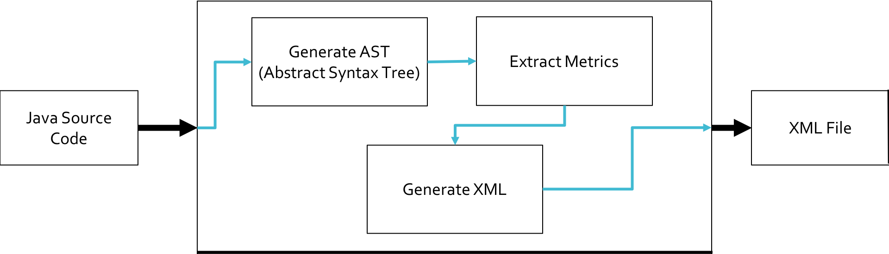

# Summary
Enterprise Java frameworks and APIs such as JPA (Java Persistence API), Spring, EJB (Enterprise Java Bean), and JUnit make extensive use of code annotations as means to allow applications to configure custom metadata and execute specific behavior. Observing the top 30 ranked Java projects on GitHub, they have, on average, 76% of classes with at least one annotation. Some projects may have more than 90% of its classes annotated. To measure code annotations usage and analyze their distribution, our previous work [@LIMA2018] proposed a novel suite of software metrics dedicated to code annotations. To obtain threshold values, the Percentile Rank Analysis approach was used [@meirelles2013]. 

Source code metrics retrieve information from software to assess its characteristics. Well-known techniques use metrics associated with rules to detect bad smells on the source code [@Lanza2006]. However, traditional code metrics does not recognize code annotations on programming elements, which can lead to an incomplete code assessment [@Guerra2009]. For instance, a domain class can be considered simple using current complexity metrics. However, it can contain complex annotations for object-XML mapping. Also, using a set of annotations couples the application to a framework that can interpret them and current coupling metrics does not explicitly handle this.

To automate the process of extracting the code annotation metrics proposed in [@LIMA2018], we developed an open source tool called Annotation Sniffier (ASniffer). It obtains the metrics values and outputs them in an XML report. The is run through the command line and requires three par


Figure 1: ASniffer Simple Diagram

The first version of this tool was previously presented and published on a workshop[@LIMA2018c]. The current version has an improved extensability mechanism as well as a more compact and complete report.


# Metadata and Code Annotations

The term `metadata` is used in a variety of contexts in the computer science field. In all of them, it means data referring to the data itself. When discussing databases, the data are the ones persisted, and the metadata is their description, i.e., the structure of the table. In the object-oriented context, the data are the instances, and the metadata is their description, i.e., information that describes the class. As such, fields, methods, super-classes, and interfaces are all metadata of a class instance. A class field, in turn, has its type, access modifiers, and name as its metadata [@guerra2014]. 

The class structure might not be enough to allow a specific behavior or routine to be executed, and therefore additional metadata can be configured on the programming elements. Afterward, a framework or tool consumes them and executes the desired behavior. For instance, metadata can be used to generate source code, compile-time verification, framework adaptation [@Guerra2010a], perform object-relational mapping, object-XML mapping and so forth.
  
```java
@Entity
@Table(name="Players")
public class Player {
    
    @Id
    @GeneratedValue(strategy = GenerationType.IDENTITY)
    private int id;
    @Column(name = "health")
    private float health;
    
    @Column(name = "name")
    private String name;
    
    @Column(name = "birthdate", nullable = false)
    private Date birthDate;
    //getters and setters omitted
}
```
Listing 1: Code Annotations Example

Consider the code on Listing 1. It is a simple Java class representing a player from a video game code. To map this class to a table in a database, to store the player's information, we need to pass in some `extra information` about these code elements. In other words, we need to define an object-relational mapping, and we need to configure which elements should be mapped to a column, table, and so forth. Using code annotations provided by the JPA API, this mapping is easily achieved. When this code gets executed, the framework consuming the annotations knows how to perform the expected behavior, which occurs as described below:

Another important definition is that of an annotation schema [@LIMA2018], defined as a set of associated annotations that belong to the same API. The annotations used in the example code are part of the JPA schema. An annotation-based API usually uses a group of related annotations that represent the set of metadata necessary for its usage.


# Annotation Metrics

In this section we briefly present the code annotation metrics proposed ou our previous work [@LIMA2018]. The code presented on Listing 2 will be used as an example to demonstrate how the metrics value are extracted.

```java
import javax.persistence.AssociationOverrides;
import javax.persistence.AssociationOverride;
import javax.persistence.JoinColumn;
import javax.persistence.NamedQuery;
import javax.persistence.DiscriminatorColumn;
import javax.ejb.Stateless;
import javax.ejb.TransactionAttribute;

@AssociationOverrides(value = {
      @AssociationOverride(name="ex",
         joinColumns = @JoinColumn(name="EX_ID")),
      @AssociationOverride(name="other",
         joinColumns = @JoinColumn(name="O_ID"))})
@NamedQuery(name="findByName",
      query="SELECT c " +
            "FROM Country c " + 
            "WHERE c.name = :name")
@Stateless
public class Example {...

   @TransactionAttribute(SUPPORTS)
   @DiscriminatorColumn(name = "type", discriminatorType = STRING)
   public String exampleMethodA(){...}

   @TransactionAttribute(SUPPORTS)
   public String exampleMethodB(){...}

   @TransactionAttribute(SUPPORTS)
   public String exampleMethodC(){...}
}
```
Listing 2: Example code to extract annotation metrics.

- Annotations in Class (AC): This metric counts the number of annotations declared on all code elements in a class, including nested annotations. In our example code, the value of AC is equal to 11. 

- Unique Annotations in Class (UAC): While AC counts all annotations, even repeated ones, UAC counts only distinct annotations. Two annotations are equal if they have the same name, and all arguments match. For instance, both annotations \texttt{@AssociationOverride} are different, for they have a nested annotation \texttt{@JoinColumn} that have different arguments. The first is \texttt{EX\_ID} while the latter is \texttt{O\_ID}. Hence they are distinct annotations and will be computed separately. The UAC value for the example class is nine. Note that the annotaiton \texttt{@TransactionAttribute()} is counted only once.

- Annotations Schemas in Class (ASC): An annotation schema represents a set of related annotations provided by a framework or tool. This measures how coupled a class is to a framework since different schemas on a class imply the class is using different frameworks. This value is obtained by tracking the imports used for the annotations. On the example code, the ASC value is two. The import \texttt{javax.persistence} is a schema provided by the JPA, and the import \texttt{javax.ejb} is provided by EJB.

- Arguments in Annotations (AA): Annotations may contain arguments. They can be a string, integer, or even another annotation. The AA metric counts the number of arguments contained in the annotation. For each annotation in the class, an AA value will be generated. For example, the \texttt{@AssociationOverrides} has only one argument named \texttt{value}, so the AA value is equal one. But \texttt{@AssociationOverride}, contains two arguments, \texttt{name} and \texttt{joinColumns}, so the AA value is two. 

- Annotations in Element Declaration (AED): The AED metric counts how many annotations are declared in each code element, including nested annotations. In the example code, the method \texttt{exampleMethodA} has an AED value of two, it has the \texttt{@TransactionAttribute} and \texttt{@DiscriminatorColumn}

- Annotation Nesting Level (ANL): Annotations can have other annotations as arguments, which translates into nested annotations. ANL measures how deep an annotation is nested. The root level is considered value zero. The annotations \texttt{@Stateless} has ANL value of zero, while \texttt{@JoinColumn} has ANL equals two. This data is because it has \texttt{@AssociationOverride} as a first level, and then the \texttt{@AssociationOverrides} adds another nesting level, hence the value ANL is two.

- LOC in Annotation Declaration (LOCAD): LOC (Line of Code), is a well-known metric that counts the number of code lines. The LOCAD is proposed as a variant of LOC that counts the number of lines used in an annotation declaration. \texttt{@AssociationOverrides} has a LOCAD value of five, while \texttt{@NamedQuery} has LOCAD equals four.

- Number of Elements (NEC): This metric measures the number of elements that can be annotated in a class, i.e., the number of programming elements that can potentially be configured with code annotations. In the example class we have three methods, \texttt{exampleMethodA}, \texttt{exampleMethodB} and \texttt{exampleMethodC}, and the class declaration \texttt{Example}. Hence we have an NEC value of four.

# Annotation Sniffer 


# License 
Annotation Sniffer is licensed under the GNU Lesser General Public License v3.0

# Acknowledgements

This work is supported by FAPESP (Fundação de Amparo à Pequisa do Estado de São Paulo), grant 2014/16236-6 and CAPES (Coordenação de Aperfeiçoamento de Pessoal de Nível Superior )

# References